# Interrupt-Driven Game Engine Architecture

## Overview
This project explores an **interrupt-driven approach** to game engine architecture, inspired by **real-time embedded systems**. Instead of relying on a traditional game loop, this engine will use an **RTOS-like task scheduler**, where tasks execute at different frequencies based on priority.

## Key Concepts
- **Interrupt-Driven Execution**: Tasks execute based on priority, similar to real-time systems.
- **Deterministic Scheduling**: High-priority tasks run more frequently.
- **Decoupled Systems**: AI, physics, animation, and rendering run independently.
- **Real-Time Constraints**: Critical tasks run exactly when needed.
- **Worker-Based Task Execution**: Workers execute queued tasks at a high rate to ensure tasks are completed within their time windows.
- **Hard Task Constraints**: If a task exceeds its time budget, execution is immediately terminated.
- **Memory Pool Allocation**: No `malloc()` calls are allowed during execution to ensure deterministic performance.
- **Built-in Profiling and Logging**: Real-time execution profiling and per-file logging for debugging and performance monitoring.
- **Lock-Free Data Exchange**: Thread synchronization is managed via atomic pointer swaps and double-buffering.

## Task Scheduling
The engine will use a **priority-based scheduler**, where tasks are executed at fixed intervals:

```mermaid
gantt
title Engine Task Scheduling
dateFormat  X
axisFormat %s ms

section Physics & AI
Physics & AI Task :active, a1, 0, 1ms

section Animation System
Animation Task :active, a2, 5, 1ms

section Rendering & Audio
Render & Audio Task :active, a3, 6, 2ms

section Background Tasks
Background Task :active, a4, 100, 5ms
```



### **Updated Task Execution Frequency and Time Budget**
| Task Type            | Frequency  | Time Budget | Notes |
|----------------------|-----------|------------|------------------------------------------|
| **Physics & AI**    | 100Hz (10ms)  | **1ms (max)** | Updates game world state (not animation). |
| **Animation System** | 160Hz (~6.25ms) | **1ms (max)** | Interpolates between physics states. |
| **Rendering & Audio** | 160Hz (~6.25ms) | **2ms (max)** | Uses interpolated animation state. |
| **Background Tasks** | 10Hz (100ms)  | **5ms** | Handles non-time-critical systems. |

### **Key Changes**
- The **1ms Input Queue is removed**, as hyper-polling inputs is unnecessary.
- Instead, inputs will be **captured and processed before the next physics/AI step**.
- **Animations are decoupled from physics updates**, allowing smooth visuals at high frame rates.
- **Workers will operate at a much higher rate** than the actual target frequencies to ensure tasks are completed within their allocated time.
- **If a task exceeds its allocated time, the entire execution is immediately terminated** to enforce strict performance constraints.
- **Memory allocation is handled via memory pools, prohibiting dynamic `malloc()` calls during runtime.**
- **Profiling tools will be built-in to monitor execution times and detect bottlenecks.**
- **A configurable logging system will provide per-file debugging control.**
- **Thread synchronization is handled using lock-free data exchange with atomic pointer swaps and double-buffering.**

## Thread Synchronization and Data Exchange
To ensure minimal overhead and prevent synchronization issues, the engine will use **atomic pointer swaps and double-buffering**:

### **Atomic Pointer Swapping**
```c
#include <stdatomic.h>

typedef struct {
    float position;
    float velocity;
} EntityState;

EntityState state_buffer[2];
atomic_int current_buffer = 0;

EntityState* get_read_state() {
    return &state_buffer[atomic_load(&current_buffer)];
}

void update_state(EntityState* new_state) {
    int next_buffer = 1 - atomic_load(&current_buffer);
    state_buffer[next_buffer] = *new_state;
    atomic_store(&current_buffer, next_buffer);
}
```
✅ **Ensures that threads never read or write the same data simultaneously.**  
✅ **Minimal overhead compared to mutex locks.**  
✅ **Always provides a valid state for rendering, avoiding race conditions.**  

### **Double-Buffering for Shared State**
- **Physics updates one buffer while rendering reads from the other.**
- **Swap happens atomically once per frame to ensure consistency.**

```c
EntityState* current_state = get_read_state();
render_frame(current_state);
```

✅ **Rendering never accesses half-updated physics data.**  
✅ **Prevents stalling between threads.**  
✅ **Ensures data consistency without performance bottlenecks.**  

### **Logging System for Debugging**
A **per-file configurable logging system** ensures minimal runtime overhead while providing detailed debug output.

```c
#ifndef LOGGING_H
#define LOGGING_H

#include <stdio.h>
#include <stdbool.h>
#include <string.h>

#define LOG_FILENAME_STRIP(path) (strrchr(path, '/') ? strrchr(path, '/') + 1 : \
                                  (strrchr(path, '\\') ? strrchr(path, '\\') + 1 : path))

#ifdef _MSC_VER // MSVC Compiler
    #define LOG_FILENAME LOG_FILENAME_STRIP(__FILE__)
#else // GCC / Clang (Works for Linux/macOS/MinGW on Windows)
    #define LOG_FILENAME LOG_FILENAME_STRIP(__BASE_FILE__)
#endif

#define LOG_MODULE_DEFINE(file, enabled) \
    static const bool LOG_ENABLED_##file = enabled

#define _LOG_PRINT(fmt, ...) \
    printf("[%s:%d] " fmt "\n", LOG_FILENAME, __LINE__, ##__VA_ARGS__)

#define LOG(...) \
    do { if (LOG_ENABLED_##__FILE__) _LOG_PRINT(__VA_ARGS__); } while(0)

#endif // LOGGING_H
```
✅ **Provides per-file logging control.**  
✅ **Ensures minimal runtime overhead.**  
✅ **Debug messages are controlled at the compilation level.**  

## Next Steps
- **Implement multi-threaded task queue** with profiling hooks.
- **Integrate logging system into all key engine components.**
- **Ensure all shared state is managed via atomic pointer swaps and double-buffering.**
- **Develop a UI tool for visualizing profiling data.**

## Conclusion
This project aims to explore a **new way to structure game engines**, inspired by **high-performance embedded systems**. By ensuring **strict execution windows and deterministic processing**, we create a **frame-perfect, ultra-stable simulation engine** with **zero dropped frames**, **smooth animations**, and **guaranteed time constraints**. 

With the **strict execution enforcement**, **embedded-style memory management**, **built-in profiling and logging**, and **lock-free data synchronization**, this engine provides **unparalleled real-time performance insights**, forcing developers to work **within real-time limits** by design.
